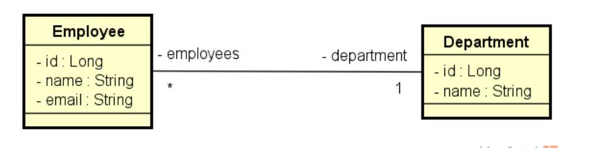

# Desafio TDD

Implemente as funcionalidades necessárias para que os testes do projeto abaixo passem:
https://github.com/devsuperior/bds01

Este é um sistema de funcionários e departamentos com uma relação N-1 entre eles:

