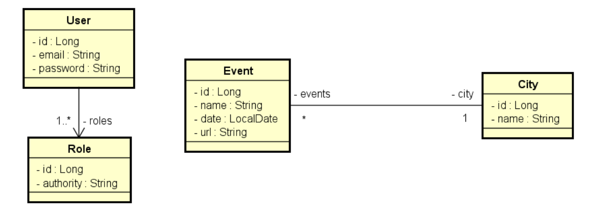

# Desafio
TAREFA: Validação e Segurança  

Implemente as funcionalidades necessárias para que os testes do projeto abaixo passem:  
- https://github.com/devsuperior/bds04

Collection do Postman:
- https://www.getpostman.com/collections/e1f59c905aeca84c1ebc

Este é um sistema de eventos e cidades com uma relação N-1 entre eles:

Neste sistema, somente as rotas de leitura (GET) de eventos e cidades são públicas (não precisa de login).   
Usuários CLIENT podem também inserir (POST) novos eventos.   
Os demais acessos são permitidos apenas a usuários ADMIN.  

Validações de City:
- Nome não pode ser vazio

Validações de Event:
- Nome não pode ser vazio
- Data não pode ser passada
- Cidade não pode ser nula

Regras de autorização do ResourceServerConfig descritas em linguagem natural.
- Os endpoints de login e do H2 devem ser públicos
- Os endpoints GET para /cities e /events devem ser públicos
- O endpoint POST de /events devem requerer login de ADMIN ou CLIENT
- Todos demais endpoints devem requerer login de ADMIN
